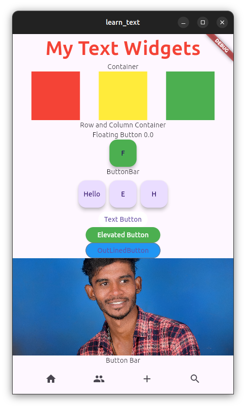

# Flutter-Projects
Learn Flutter application development...

## Widgets Learned
Text, Container, Row, Column, FlatButton (TextButton), RaiseButton(ElevatedButton), OutLinedButton, FloatingActionButton, Images, ButtonBar, Icons

